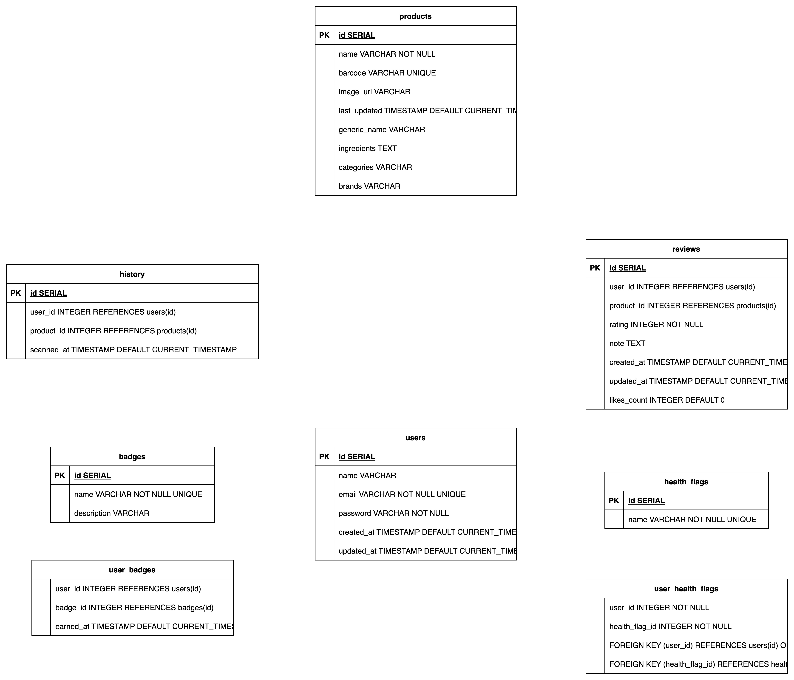

* This backend project is built using FastAPI, SQLAlchemy, and Alembic for database migrations. Below is an overview of the directory structure and responsibilities:

## Project Structure

backend/
├── alembic/               # Alembic migration files
│   ├── versions/          # Auto-generated DB migration scripts
│   ├── env.py             # Alembic environment setup
│   └── script.py.mako     # Template for new migration scripts
│
├── app/                   # Main FastAPI application package
│   ├── core/              # Configuration, constants, settings
│   ├── crud/              # Database operation logic (CRUD functions)  
│   ├── db/                # Database initialization and session
│   ├── models/            # SQLAlchemy ORM models
│   ├── routers/           # API route definitions (User, Product, etc.)
│   ├── schemas/           # Pydantic schemas for request/response validation
│   ├── utils/             # Utility functions (e.g., hashing, common tools)
│   └── main.py            # FastAPI application entry point        

## Running the backend
Make sure you have Docker installed.

```bash
docker compose up --build
```

## Comments
My apologies — the current comments for individual methods are insufficient. I’ll be adding detailed explanations tomorrow.


## API Documentation

The API documentation is available at:

http://localhost:8000/docs

* `POST /users`
     - Create a new user
     - Request Body:
        ```json
        {
            "name": "John Doe",
            "email": "john.doe@example.com",
            "health_flags": ["flag1", "flag2"],
            "badges": ["badge1", "badge2"],
            "password": "password123"
        }
        ```
     - Response:
        ```json
        {
            "id": "ID",
            "name": "NAME",
            "email": "EMAIL",
            "health_flags": ["flag1", "flag2"],
            "badges": ["badge1", "badge2"]
        }
        ``` 

* `GET /users/{user_id}`
    - Test Success in FastAPI Swagger
    - Get a user by ID
    - Path Parameters:
        ```json
        {
            "user_id": "ID"
        }
        ```
     - Response:
        ```json
        {
            "id": "ID",
            "name": "NAME",
            "email": "EMAIL",
            "health_flags": ["flag1", "flag2"],
        }
        ```

* `PATCH /users/{user_id}`
    - Test Success in FastAPI Swagger
    - Update a user by ID
    - Path Parameters:
        ```json
        {
            "user_id": "ID"
        }
        ```
     - Request Body:
        ```json
        {   
            "name": "NAME",
        }
        ```
     - Response:
        ```json
        {
            "msg": "User updated successfully"
        }
        ```
* `POST/user/{user_id}/badges`
     - Add a badge to a user
     - Path Parameters:
        ```json
        {
            "user_id": "ID"
        }
        ```
     - Request Body:
        ```json
        {
            "badge_id": "ID"
        }
        ```
     - Response:
        ```json
        {
            "msg": "Badge added successfully"
        }
        ```
* `GET/users/{user_id}/history`
     - Get the history of a user
     - Path Parameters:
        ```json
        {
            "user_id": "ID"
        }
        ```
     - Response:
        ```json
        {
            "history": [
                {

                }
            ]
        }
* `POST/users/{user_id}/histoty`
     - Add a history item to a user
     - Path Parameters:
        ```json
        {
            "user_id": "ID"
        }
        ```
     - Request Body:
        ```json
        {
            "history": "HISTORY"
        }
        ```
* `GET/products `
     - Get all products
     - Response:
        ```json
        {
            "products": [
                {
                    "id": "ID",
                    "name": "NAME",
                    "description": "DESCRIPTION"
                },
                {
                    "id": "ID",
                    "name": "NAME",
                    "description": "DESCRIPTION"
                }
            ]
        }
* `GET/products/{product_id}`
     - Get a product by ID
     - Path Parameters:
        ```json
        {
            "product_id": "ID"
        }   
        ```
     - Response:
        ```json
        {
            "product": "PRODUCT"
        }
        ``` 
* `POST/products`
     - Create a new product
     - Request Body:
        ```json
        {
            "name": "NAME",
            "description": "DESCRIPTION"
        }
        ```
     - Response:
        ```json
        {
            "msg": "Product created successfully"
        }
        ```
* `GET/products/barcode/{barcode}   `
     - Get a product by barcode
     - Path Parameters:
        ```json
        {
            "barcode": "BARCODE"
        }   
        ```
     - Response:
        ```json
        {
            "product": "PRODUCT"
        }   
        ```
* `PATCH/products/{product_id}`
     - Update a product by ID
     - Path Parameters:
        ```json
        {
            "product_id": "ID"
        }
        ```
     - Request Body:
        ```json
        {
            "name": "NAME",
        }   
        ```
     - Response:
        ```json
        {
            "msg": "Product updated successfully"
        }  
        ```
* `GET/products/{product_id}/reviews`
     - Get all reviews for a product
     - Path Parameters:
        ```json
        {
            "product_id": "ID"
        }   
        ```
     - Response:
        ```json
        {
            "reviews": [
                {
                    "id": "ID",
                    "name": "NAME",
                    "description": "DESCRIPTION"
                },
                {
                    "id": "ID",
                    "name": "NAME",
                    "description": "DESCRIPTION"
                }
            ]
        }     
        ```
* `POST/products/{product_id}/reviews`
     - Create a new review for a product
     - Path Parameters:
        ```json
        {
            "product_id": "ID"
        }
        ```
     - Request Body:
        ```json
        {
            "review": "REVIEW"
        }   
        ```
     - Response:
        ```json
        {
            "msg": "Review created successfully"
        } 
        ```
* `GET/users/{user_id}/reviews      `
     - Get all reviews for a user
     - Path Parameters:
        ```json
        {
            "user_id": "ID"
        }   
        ```
     - Response:
        ```json
        {
            "reviews": "REVIEWS"
        }    
        ```
* `GET/reviews/{review_id}`
     - Get a review by ID
     - Path Parameters:
        ```json
        {
            "review_id": "ID"
        }   
        ```
     - Response:
        ```json
        {
            "review": "REVIEW"
        }   
        ```
* `POST/reviews/{review_id}/like`
     - Like a review
     - Path Parameters:
        ```json
        {
            "review_id": "ID"
        }   
        ```
     - Response:
        ```json
        {
            "msg": "Review liked successfully"
        }  
        ```
## Database
