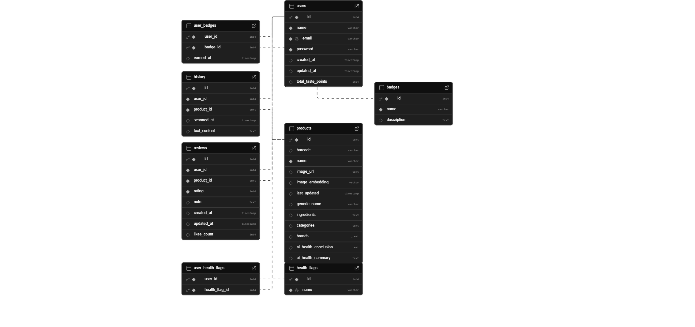

* This backend project is built using FastAPI, SQLAlchemy, and Alembic for database migrations. Below is an overview of the directory structure and responsibilities:

## Project Structure

backend/
├── alembic/               # Alembic migration files
│   ├── versions/          # Auto-generated DB migration scripts
│   ├── env.py             # Alembic environment setup
│   └── script.py.mako     # Template for new migration scripts
│
├── app/                   # Main FastAPI application package
│   ├── core/              # Configuration, constants, settings
│   ├── crud/              # Database operation logic (CRUD functions)  
│   ├── db/                # Database initialization and session
│   ├── models/            # SQLAlchemy ORM models
│   ├── routers/           # API route definitions (User, Product, etc.)
│   ├── schemas/           # Pydantic schemas for request/response validation
│   ├── utils/             # Utility functions (e.g., hashing, common tools)
│   └── main.py            # FastAPI application entry point        
│
├── certs/
│   ├── cert.pem/          # The Certificate enable HTTPS for dev env
│   ├── key.pem/           # The Private Key enable HTTPS for dev env
│
├── postman/
│   ├── FlavorPal_API_v1.postman_collection.json          # Postman collection for FlavorPal API.

## Running the backend
Make sure you have Docker installed.

```bash
docker compose up --build
```

## Create .env file
``` bash
cp .env.example .env
```

## Configure FastAPI/Uvicorn to use HTTPS
- You can use OpenSSL for this. Run these commands in terminal
``` bash
cd flavorpal-app/backend/certs
# Generate a private key
openssl genpkey -algorithm RSA -out key.pem

# Generate a self-signed certificate using the private key
openssl req -new -key key.pem -x509 -days 365 -out cert.pem
```
- This will ask you for some information (Country Name, Organization, etc.). You can fill these as you like for a development certificate. This creates key.pem (your private key) and cert.pem (your certificate).

## JWT Configuration
- Example using OpenSSL to generate JWT SECRET KEY
``` bash
openssl rand -base64 32
```

## Comments
My apologies — the current comments for individual methods are insufficient. I’ll be adding detailed explanations tomorrow.


## API Documentation

The API documentation is available at:

https://localhost:8000/docs

## Base URL
https://localhost:8000/

* `POST /users`
     - Create a new user
     - Request Body:
        ```json
        {   
            
            "name": "John Doe",
            "email": "john.doe@example.com",
            "health_flags": ["flag1", "flag2"],
            "badges": ["badge1", "badge2"],
            "password": "password123"
        }
        ```
     - Response:
        ```json
        {
            "code": 200,
            "data": {
                "id": "ID",
                "name": "NAME",
                "email": "EMAIL",
                "health_flags": ["flag1", "flag2"],
                "badges": ["badge1", "badge2"]
            },
            "msg": "User created successfully"
        }
        ``` 
* `GET /users/{user_id}`
    - Test Success in FastAPI Swagger
    - Get a user by ID
    - Path Parameters:
        ```json
        {
            "user_id": "ID"
        }
        ```
     - Response:
        ```json
        {
            "code": 200,
            "data": {
                "id": "ID",
                "name": "NAME",
                "email": "EMAIL",
                "health_flags": ["flag1", "flag2"],
                "badges": ["badge1", "badge2"],
                "created_at": "2021-01-01T00:00:00Z",
                "updated_at": "2021-01-01T00:00:00Z"
            },
            "msg": "User fetched successfully"
        }
        ```

* `PATCH /users/{user_id}`
    - Test Success in FastAPI Swagger
    - Update a user by ID
    - Path Parameters:
        ```json
        {
            "user_id": "ID"
        }
        ```
     - Request Body:
        ```json
        {   
            "name": "NAME",
            "email": "EMAIL",
            "health_flags": ["flag1", "flag2"],
            "badges": ["badge1", "badge2"]
        }
        ```
     - Response:
        ```json
        {
            "code": 200,
            "data": {
                "id": "ID",
                "name": "NAME",
                "email": "EMAIL",
                "health_flags": ["flag1", "flag2"],
                "badges": ["badge1", "badge2"]
            },
            "msg": "User updated successfully"
        }
          ```

* `POST/user/{user_id}/badges`
     - Add a badge to a user
     - Path Parameters:
        ```json
        {
            "user_id": "ID"
        }
        ```
     - Request Body:
        ```json
        {
            "badge_id": "ID"
        }
        ```
     - Response:
        ```json
        {
            "code": 200,
            "data": {
                "badges": ["badge1", "badge2"]
            },
            "msg": "Badge added successfully"
        }
        ```


* `GET/products `
     - Get all products
     - Response:
        ```json
        {
            "code": 200,
            "data": [
                {
                    "id": "ID",
                    "name": "NAME",
                    "description": "DESCRIPTION"
                },
                {
                    "id": "ID",
                    "name": "NAME",
                    "description": "DESCRIPTION"
                }
            ]
        },
        "msg": "Products fetched successfully"
        }
        ```
* `GET/products/{product_id}`
     - Get a product by ID
     - Path Parameters:
        ```json
        {
            "product_id": "ID"
        }   
        ```
     - Response:
        ```json
        {
            "code": 200,
            "data": {
                "id": "ID",
                "name": "NAME",
                "generic_name": "GENERIC_NAME",
                "ingredients": "INGREDIENTS",
                "categories": "CATEGORIES",
                "brands": "BRANDS"
            },
            "msg": "Product fetched successfully"
        }
        ``` 
* `POST/products`
     - Create a new product
     - Request Body:
        ```json
        {
            "name": "NAME",
            "image_url": "IMAGE_URL",
            "barcode": "BARCODE",
            "generic_name": "GENERIC_NAME",
            "ingredients": "INGREDIENTS",
            "categories": "CATEGORIES",
            "brands": "BRANDS"
        }
        ```
     - Response:
        ```json
        {
            "code": 200,
            "data": {
                "id": "ID",
                "name": "NAME",
                "generic_name": "GENERIC_NAME",
                "ingredients": "INGREDIENTS",
            "msg": "Product created successfully"
        }
        ```
* `GET/products/barcode/{barcode}   `
     - Get a product by barcode
     - Path Parameters:
        ```json
        {
            "barcode": "BARCODE"
        }   
        ```
     - Response:
        ```json
        {
            "code": 200,
            "data": {
                "id": "ID",
                "name": "NAME",
                "generic_name": "GENERIC_NAME",
                "ingredients": "INGREDIENTS",
            "msg": "Product fetched successfully"
        }   
        ```
* `PATCH/products/{product_id}`
     - Update a product by ID
     - Path Parameters:
        ```json
        {
            "product_id": "ID"
        }
        ```
     - Request Body:
        ```json
        {
            "name": "NAME",
        }   
        ```
     - Response:
        ```json
        {
            "code": 200,
            "data": {
                "id": "ID",
                "name": "NAME",
                "generic_name": "GENERIC_NAME",
                "ingredients": "INGREDIENTS",
            "msg": "Product updated successfully"
        }  
        ```
* `GET reviews/products/{product_id}/`
     - Get all reviews for a product
     - Path Parameters:
        ```json
        {
            "product_id": "ID"
        }
        ```
     - Response:
        ```json
        {
            "code": 200,
            "data": [
                {
                    "id": "ID",
                    "name": "NAME",
                    "generic_name": "GENERIC_NAME",
                    "ingredients": "INGREDIENTS",
                    "categories": "CATEGORIES",
                    "brands": "BRANDS",

                }
            ],
            "msg": "Reviews fetched successfully"
        }
* `POST reviews/products/{product_id}/`
     - Create a new review for a product
     - Path Parameters:
        ```json
        {
            "product_id": "ID",
            "user_id": "ID",
        }
        ```
     - Request Body:
        ```json
        {
            "rating": 5,
            "note": "NOTE",
            "created_at": "2021-01-01T00:00:00Z",
            "updated_at": "2021-01-01T00:00:00Z",
            "likes_count": 0
        }
     - Response:
        ```json
            {
            "code": 200,
            "data": {
                "id": "ID",
                "name": "NAME",
                "generic_name": "GENERIC_NAME",
                "ingredients": "INGREDIENTS",
                    },
            "msg": "Review created successfully"
            }   
        ```
* `GET/users/{user_id}/reviews      `
     - Get all reviews for a user
     - Path Parameters:
        ```json
        {
            "user_id": "ID"
        }
        ```
     - Response:
        ```json
        {
            "code": 200,
            "data": [
                {
                    "id": "ID",
                    "name": "NAME",
                    "generic_name": "GENERIC_NAME",
                    "ingredients": "INGREDIENTS",
                }   
            ],
            "msg": "Reviews fetched successfully"
        }
* `GET/reviews/{review_id}`
     - Get a review by ID
     - Path Parameters:
        ```json
        {
            "review_id": "ID"
        }
        ``` 
     - Response:
        ```json
        {
            "code": 200,
            "data": {
                "id": "ID",
                "user_id": "ID",
                "product_id": "ID",
                "rating": 5,
                "note": "NOTE",
                "created_at": "2021-01-01T00:00:00Z",
                "updated_at": "2021-01-01T00:00:00Z",
                "likes_count": 0
            },  
            "msg": "Review fetched successfully"
        }
        ```
* `POST/reviews/{review_id}/like`
     - Like a review
     - Path Parameters:
        ```json
        {
            "review_id": "ID"
        }
        ```
     - Response:
        ```json
        {
            "code": 200,
            "data": {
                "rating": 5,
                "note": "NOTE",
                "created_at": "2021-01-01T00:00:00Z",
                "updated_at": "2021-01-01T00:00:00Z",
                "likes_count": 1
            },
            "msg": "Review liked successfully"
        }
        ```
        
## Database


## Supabase

> See `./app/db/schema.sql` for more details

- `db_helper`: provides functions that help interact with supabase
    - `upload_image_to_bucket`
    - `send_to_image_encode_endpoint`: send image to AI image encoding endpoint and get embedding.
    - `most_similar_img`: get most similar product based on image embedding
    - sample usage are also provided in this file.
